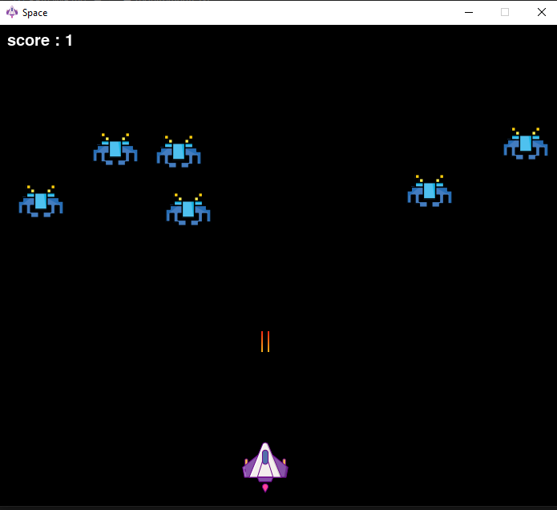

# 🚀 Space Shooter Game in Python with Pygame

This is a simple 2D space shooter game built using Python and the Pygame library. The player controls a spaceship that moves horizontally at the bottom of the screen, shooting bullets to destroy incoming enemies. The game tracks the player's score and ends when any enemy reaches the bottom of the screen.

---

# 🧩 Game Features
- **Player Movement:** Move the spaceship left or right using the arrow keys.

- **Shooting Mechanism:** Press the spacebar to fire bullets upwards.

- **Enemy Waves:** Multiple enemies move horizontally and descend gradually.

- **Collision Detection:** Bullets destroy enemies upon collision.

- **Score Tracking:** Displays the current score at the top-left corner.

- **Game Over Condition:** Game ends when any enemy reaches the bottom of the screen.​

---

# 📦 Requirements
Ensure you have Python and Pygame installed:
```python
pip install pygame
```

# 🧱 Game Structure
1. ### Initialization
```python
pygame.init()
screen = pygame.display.set_mode((700, 600))
pygame.display.set_caption("Space")
icon = pygame.image.load("spaceship.png")
pygame.display.set_icon(icon)
```
- Initialize Pygame and set up the gamewindow with a size of 700x600 pixels.

- Set the window title to "Space" and the window icon to a spaceship image.​

2. ### Player Setup
```python
playerImg = pygame.image.load("player.png")
playerX = 300
playerY = 520
playerX_change = 0
```
- Load the player's spaceship image.

- Set the initial position of the player at coordinates (300, 520).

- Initialize the horizontal movement change (playerX_change) to 0.​

3. ### Enemy Setup
```python
enemyImg = []
enemyX = []
enemyY = []
enemyX_change = []
enemyY_change = []
num_of_enemies = 6
for i in range(num_of_enemies):
    enemyImg.append(pygame.image.load("enemy.png"))
    enemyX.append(random.randint(0, 700))
    enemyY.append(random.randint(50, 150))
    enemyX_change.append(0.3)
    enemyY_change.append(30)
```    
- Initialize lists to hold enemy images,positions, and movement changes.

- Create 6 enemies with random starting positions and set their movement speeds.​


4. ### Bullet Setup
```python
bulletImg = pygame.image.load("bullet.png")
bulletX = 0
bulletY = 520
bulletX_change = 0
bulletY_change = 0.8
bullet_state = "ready"
```
- Load the bullet image.

- Set the initial position of the bullet off-screen.

- Define movement changes for the bullet and set its initial state to "ready".​

5. ### Score and Fonts
```python
score_value = 0
font = pygame.font.Font("freesansbold.ttf", 20)
textX = 10
textY = 10
```
- Initialize the score to 0.

- Set up the font for displaying the score.

- Define the position for displaying the score on the screen.​

# 🛠 Functions
==show_score(x, y)==
Displays the current score at the specified (x, y) position on the screen.​

==game_over_text()==
Displays the game over message along with the final score at the center of the screen.​

==player(x, y)==
Draws the player's spaceship at the specified (x, y) position.​

==enemy(x, y, i)==
Draws the i-th enemy at the specified (x, y) position.​

==fire_bullet(x, y)==
Fires a bullet from the player's current position and changes its state to "fire".​

==iscollision(enemyX, enemyY, bulletX, bulletY)==
Checks if a bullet has collided with an enemy using the distance formula. If the distance is less than 27 pixels, a collision is detected.​

# 🎮 Main Game Loop
```python
running = True
while running:
    screen.fill((0, 0, 0))
    for event in pygame.event.get():
        if event.type == pygame.QUIT:
            running = False
        if event.type == pygame.KEYDOWN:
            if event.key == pygame.K_LEFT:
                playerX_change = -0.3
            if event.key == pygame.K_RIGHT:
                playerX_change = 0.3
            if event.key == pygame.K_SPACE and bullet_state == "ready":
                bulletX = playerX
                fire_bullet(bulletX, bulletY)
        if event.type == pygame.KEYUP:
            if event.key in [pygame.K_LEFT, pygame.K_RIGHT]:
                playerX_change = 0

    playerX += playerX_change
    playerX = max(0, min(playerX, 636))

    for i in range(num_of_enemies):
        if enemyY[i] > 500:
            for j in range(num_of_enemies):
                enemyY[j] = 2000
            game_over_text()
            break

        enemyX[i] += enemyX_change[i]
        if enemyX[i] <= 0 or enemyX[i] >= 636:
            enemyX_change[i] *= -1
            enemyY[i] += enemyY_change[i]

        if iscollision(enemyX[i], enemyY[i], bulletX, bulletY):
            bulletY = 480
            bullet_state = "ready"
            score_value += 1
            enemyX[i] = random.randint(0, 700)
            enemyY[i] = random.randint(50, 150)

        enemy(enemyX[i], enemyY[i], i)

    if bulletY <= 0:
        bulletY = 520
        bullet_state = "ready"

    if bullet_state == "fire":
        fire_bullet(bulletX, bulletY)
        bulletY -=
::contentReference[oaicite:43]{index=43}
``` 

